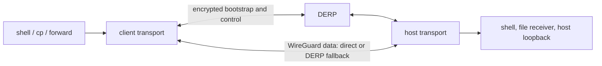

# tsok

**Temporary sockets over tsnet.**

`tsok` is a CLI for creating temporary, authenticated TCP and UDP connections
between two machines. One machine runs `tsok serve`; clients holding its auth
key can open shells, copy files, or reach services on the host's loopback
interface.

Application traffic uses an encrypted WireGuard connection. tsok attempts a
direct peer-to-peer path and falls back to Tailscale's public DERP relays when
direct connectivity is unavailable. No Tailscale account is required.

## Install

Install the latest Linux or macOS release for `amd64` or `arm64` into
`$HOME/.local/bin/tsok`:

```bash
curl -fsSL https://raw.githubusercontent.com/changhoon-sung/tsok/main/install.sh | sh
```

The installer detects the current platform and downloads the matching archive
from the latest GitHub release. If `$HOME/.local/bin` is not on your `PATH`, add
this to your shell profile:

```bash
export PATH="$HOME/.local/bin:$PATH"
```

Update an installed binary to the latest release:

```bash
tsok update
```

The updater downloads the same platform archive as the installer, verifies it
against the release SHA-256 checksums, and atomically replaces the current
executable. The running process finishes normally; the new version is used on
the next invocation. The executable's directory must be writable by the
current user.

The `serve`, `shell`, `cp`, and `forward` commands also perform this update as
a best-effort check at most once every 24 hours. Update failures never block the
requested command. Set `TSOK_NO_AUTO_UPDATE=1` to disable automatic updates;
`tsok update` remains available for an explicit update.

## Quick start

On the host machine:

```console
$ tsok serve
01:26:50 Picked DERP region Toronto as overlay home

Your auth key is:
  > <auth-key>
Use this key to authenticate other tsok commands to this instance.

Connect with SSH:
TSOK_AUTH_KEY=<auth-key> ssh -o 'ProxyCommand=tsok forward --tcp-stdio %p --quiet' user@tsok

Or add this block to ~/.ssh/config:

Host tsok
  HostName tsok
  User user
  ProxyCommand env TSOK_AUTH_KEY=<auth-key> tsok forward --tcp-stdio %p --quiet
```

On a client machine:

```bash
# Open the built-in shell.
TSOK_AUTH_KEY=<auth-key> tsok shell

# Run one command on the host.
TSOK_AUTH_KEY=<auth-key> tsok shell -- uname -a

# Copy one file to the host's current directory.
TSOK_AUTH_KEY=<auth-key> tsok cp report.txt

# Forward host TCP port 8080 to client port 3000.
TSOK_AUTH_KEY=<auth-key> tsok forward --tcp 3000:8080

# Forward host UDP port 53 to client port 5353.
TSOK_AUTH_KEY=<auth-key> tsok forward --udp 5353:53
```

If an SSH server is listening on the host's loopback port 22, saving the
generated config block enables the system OpenSSH client and tools built on it:

```bash
ssh tsok
scp report.txt tsok:/tmp/
rsync -av ./project/ tsok:/tmp/project/
```

## Commands

| Command | Purpose |
| --- | --- |
| `tsok serve` | Accept authenticated client connections |
| `tsok update` | Replace the current executable with the latest release |
| `tsok shell [command...]` | Open the built-in shell or run one command |
| `tsok cp <file>` | Copy one local file to the host |
| `tsok forward --tcp <local>:<remote>` | Forward a local TCP listener to host loopback |
| `tsok forward --udp <local>:<remote>` | Forward a local UDP listener to host loopback |
| `tsok forward --tcp-stdio <remote>` | Bridge stdin/stdout to one host TCP port |

`--tcp` and `--udp` bind to client loopback by default. A three-field forward
such as `127.0.0.1:3000:8080` selects the local bind address. Remote
destinations always use the host's loopback interface.

`--tcp-stdio` creates no local listener. It is intended for OpenSSH
`ProxyCommand` and other clients that can communicate over stdin/stdout.

## Security model

The auth key is a bearer credential. By default, anyone holding it can:

- open a shell as the user running `tsok serve`;
- copy files into that user's current directory; and
- connect to arbitrary TCP and UDP ports on the host's loopback interface.

If `tsok serve` runs as root, the auth key grants root-equivalent access. Share
it only with trusted clients and stop the server when the temporary access is
no longer needed.

Multiple client processes may use one auth key concurrently. Each process has
an independent session and transport lifecycle; tsok does not impose a fixed
connection-count limit.

## Architecture



DERP bootstraps the peers and carries small control messages. Application data
travels through WireGuard, directly when NAT traversal succeeds and through
DERP otherwise.

## Compatibility

tsok is an independent project derived from
[`coder/wush`](https://github.com/coder/wush). It is not backward-compatible
with wush. Do not mix their binaries, auth keys, or configuration.

## Build from source

Building requires Go 1.27 or newer.

```bash
make build
./dist/tsok --help
```

Build the release archives with:

```bash
make linux
make darwin
make release-builds
```

The release matrix is:

```text
tsok_linux_amd64.tar.gz
tsok_linux_arm64.tar.gz
tsok_darwin_amd64.tar.gz
tsok_darwin_arm64.tar.gz
```

Every archive contains one executable named `tsok`. Run `make test` to execute
the test suite with the race detector.

## License

tsok is released under [Apache License 2.0](LICENSE). Third-party components
retain their respective licenses. Run `tsok licenses` to locate the dependency
report for the exact commit used to build the CLI.
