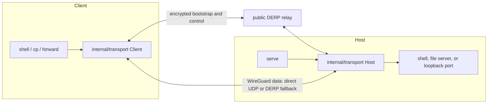
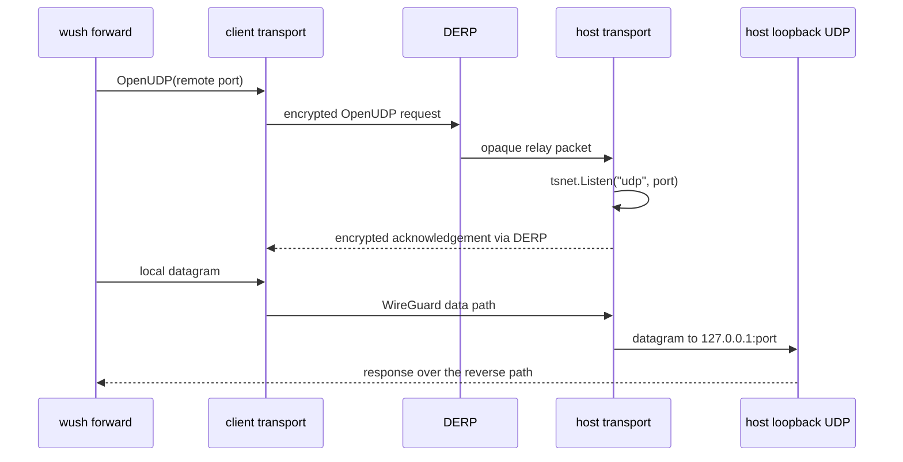

# wush

`wush` is a command line tool that lets you easily transfer files and open
shells over a peer-to-peer WireGuard connection. It's similar to
[magic-wormhole](https://github.com/magic-wormhole/magic-wormhole) but:

1. No requirement to set up or trust a relay server for authentication.
1. Powered by WireGuard for secure, fast, and reliable connections.
1. Automatic peer-to-peer connections over UDP.
1. Endless possibilities; rsync, ssh, etc.

> [!NOTE]
> This repository maintains the native CLI only. The former browser,
> WebAssembly, and hosted website clients are intentionally out of scope.
> Auth keys now use protocol version 2. New clients continue to accept version
> 1 CLI auth keys, while older clients reject version 2 keys before connecting.
> Upgrade clients before servers in mixed-version deployments.

This is an independent fork of [`coder/wush`](https://github.com/coder/wush).
It is not affiliated with or endorsed by Coder Technologies.

## Basic Usage

On the host machine:

```bash
$ wush serve
01:26:50 Picked DERP region Toronto as overlay home

Your auth key is:
    >  <auth-key>
Use this key to authenticate other wush commands to this instance.

Open a zero-configuration shell:
WUSH_AUTH_KEY=<auth-key> wush shell

Connect with system OpenSSH:
WUSH_AUTH_KEY=<auth-key> ssh -o 'ProxyCommand=wush forward --tcp-stdio %p --quiet' coder@wush

Or add this block to ~/.ssh/config:
Host wush
  HostName wush
  User coder
  ProxyCommand env WUSH_AUTH_KEY=<auth-key> wush forward --tcp-stdio %p --quiet

```

On the client machine:

```bash
# Copy a file to the host
$ WUSH_AUTH_KEY=<auth-key> wush cp 1gb.txt
Uploading "1gb.txt" 100% |██████████████████████████████████████████████| (2.1/2.1 GB, 376 MB/s)

# Open a shell to the host
$ WUSH_AUTH_KEY=<auth-key> wush shell
coder@colin:~$

# Run one command as the wush serve user
$ WUSH_AUTH_KEY=<auth-key> wush shell -- uname -a

# Or use the system OpenSSH client without a local listening port
$ WUSH_AUTH_KEY=<auth-key> ssh -o 'ProxyCommand=wush forward --tcp-stdio %p --quiet' coder@wush

# After saving the generated block to ~/.ssh/config
$ ssh wush

# Expose the host's TCP port 8080 on client port 3000
$ WUSH_AUTH_KEY=<auth-key> wush forward --tcp 3000:8080

# Expose the host's UDP port 53 on client port 5353
$ WUSH_AUTH_KEY=<auth-key> wush forward --udp 5353:53
```

`wush shell` is a zero-configuration remote shell, not a complete OpenSSH
replacement. It needs no `sshd`, host key, `authorized_keys`, separate account
configuration, or system service on the host. It provides a PTY-backed
interactive shell and single remote command execution as the user running
`wush serve`. The encrypted wush overlay authenticates the connection, so the
auth key is a bearer credential for that user's shell privileges.

> [!WARNING]
> If `wush serve` runs as root, anyone holding its auth key can open a root
> shell. Treat the auth key as a root credential in that configuration.

| Command | Intended use |
| --- | --- |
| `wush shell` | Zero-configuration, one-off shell or remote command |
| `wush forward --tcp <local>:<remote>` | Listen locally and forward TCP to the host |
| `wush forward --udp <local>:<remote>` | Listen locally and forward UDP datagrams to the host |
| `wush forward --tcp-stdio <remote>` | Bridge one host TCP port to stdin/stdout |
| System `ssh` | Multiple users and complete OpenSSH features |

The built-in shell does not aim to provide per-user SSH authentication, SFTP,
agent forwarding, SSH certificates, or SSH port forwarding. Those features
remain the responsibility of system OpenSSH over `wush forward --tcp-stdio`.

Before starting `wush shell`, the client checks its current path. If it is
already direct, the client reports `Peer connection: direct`. If the peer is
first reachable over DERP, it reports `Peer reachable via relay (<region>)` and
`Negotiating direct connection...`, then probes for a direct UDP path for up to
five seconds. It either reports `Peer connection: direct` or
`Direct connection unavailable; continuing via relay (<region>)`.
`--wait-p2p` keeps waiting until a direct path is available instead of falling
back to the relay. `--quiet` suppresses these diagnostics and skips the default
bounded check unless `--wait-p2p` is also set.

`wush forward` is the single general-purpose tunnel command. `--tcp` and
`--udp` create local listeners. A one- or two-port specification binds local
loopback; a three-field specification can change the local bind address. The
destination is always the host's loopback interface. `--tcp-stdio` skips the
local listener and bridges stdin/stdout directly to one host TCP port. This
makes it suitable for OpenSSH `ProxyCommand` and
other clients that support a stdio transport, while keeping features such as
agent forwarding, port forwarding, `scp`, `rsync`, and IDE SSH integrations in
the system OpenSSH client. Multiple client processes may use the same wush auth
key concurrently; stopped processes are removed from the active peer set.

TCP destinations are accepted by tsnet's fallback handler and dialed on the
host loopback interface. UDP has no equivalent fallback handler, so the client
first sends an authenticated `OpenUDP` request through the encrypted DERP
overlay. `wush serve` then opens that UDP port inside tsnet for the requesting
session and forwards its datagrams to the same host loopback port. Repeating a
request is idempotent, multiple sessions can share a port, and the listener is
closed after its last requesting session disconnects or expires.

Runtime logs use a consistent timestamp. When a peer establishes a direct
WireGuard path, `wush serve` reports the peer IP and its UDP endpoint. If a
direct path is unavailable, it reports the relay region name and code, for
example `Toronto (tor)`.

`wush` always uses DERP for authenticated peer bootstrap. This does not force
application data through the relay: tsnet still uses the DERP map's STUN
endpoints to probe direct UDP paths and falls back to DERP only when needed.

[](https://asciinema.org/a/ZrCNiRRkeHUi5Lj3fqC3ovLqi)

> [!NOTE]  
> `wush` uses Tailscale's [tsnet](https://tailscale.com/kb/1244/tsnet) package
> under the hood, managed by an in-memory control server on each CLI. We utilize
> Tailscale's public [DERP relays](https://tailscale.com/kb/1232/derp-servers),
> but no Tailscale account is required.

## Build from source

Building from source requires Go 1.27 or newer. From the repository root:

```bash
make build
./dist/wush_$(go env GOOS)_$(go env GOARCH) --help
```

Every output filename includes its operating system and architecture. Build
both supported Linux binaries, both macOS binaries, or the complete release
matrix with:

```bash
make linux
make darwin
make release-builds
```

The release matrix contains `wush_{linux,darwin}_{amd64,arm64}`. Run
`make test` to execute the test suite with the race detector.

## Install

Install the latest Linux or macOS release for `amd64` or `arm64`:

```bash
curl -fsSL https://raw.githubusercontent.com/changhoon-sung/wush/main/install.sh | sh
```

For a manual installation, see the
[latest release](https://github.com/changhoon-sung/wush/releases/latest).

> [!TIP]
> To increase transfer speeds, `wush` attempts to increase the buffer size of
> its UDP sockets. For best performance, ensure `wush` has `CAP_NET_ADMIN`. When
> using the installer script, this is done automatically for you.
>
> ```bash
> # Linux only
> sudo setcap cap_net_admin=eip $(which wush)
> ```

## Technical Details



For a UDP forward, the small listener request uses the control path before any
application datagrams use the WireGuard data path:



`wush` doesn't require you to trust any 3rd party authentication or relay
servers, instead using x25519 keys to authenticate incoming connections. Auth
keys generated by `wush serve` are separated into a couple parts:

```text
<base58-encoded-auth-key>

+--------------+----------------+---------------------+------------------+--------------------------+---------------------------+
| Version (1B) | Peer Type (1B) | UDP Address (1-19B) | DERP Region (2B) | Server Public Key (32B)  | Sender Private Key (32B) |
+--------------+----------------+---------------------+------------------+--------------------------+---------------------------+
|            2 |        0 (CLI) | 203.128.89.74:57321 |               21 | QPGoX1...488YNqsyWM=     | o/FXVn...llrKg5bqxlgY=   |
+--------------+----------------+---------------------+------------------+--------------------------+---------------------------+
```

Senders and receivers communicate through an encrypted control overlay over
DERP. It exchanges WireGuard node information and small runtime requests such
as opening a UDP forwarding port. DERP treats these as opaque packets; the
wush endpoints define, encrypt, authenticate, and interpret their contents.
The receiver only accepts messages encrypted with the private key carried by
the auth key and addressed to the server's public key.

Application traffic then travels inside the resulting WireGuard connection.
Tailscale's networking stack probes direct UDP paths using the DERP map's STUN
servers and keeps DERP as the fallback data path when direct connectivity is
not possible.

The CLI-specific lifecycle is centralized in `internal/transport`: client and
host setup, the in-memory control server, ephemeral tsnet instance, peer route
discovery, dialing, and runtime UDP listener leases. Commands only provide
their application behavior: shell, file transfer, stdio bridging, or local
TCP/UDP listeners.

## Why create another file transfer tool?

Lots of great file transfer tools exist, but they all have some limitations:

1. Slow speeds due to relay servers.
1. Trusting a 3rd party server for authentication.
1. Limited to only file transfers.

We sought to utilize advancements in userspace networking brought about by
Tailscale to create a tool that could solve all of these problems, and provide
way more functionality.

## Acknowledgements

1. [Tailscale](https://tailscale.com)
1. [Headscale](https://github.com/juanfont/headscale)
1. [WireGuard-go](https://github.com/WireGuard/wireguard-go)

## License

wush is released under the [Apache License 2.0](LICENSE). Third-party
components retain their respective licenses. Run `wush licenses` to show the
dependency license report URL for the exact commit used to build the CLI.
